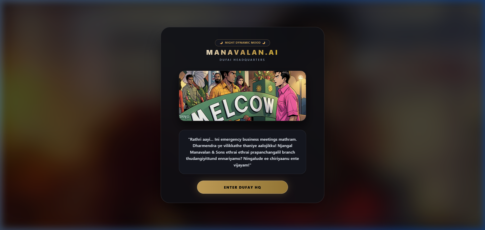
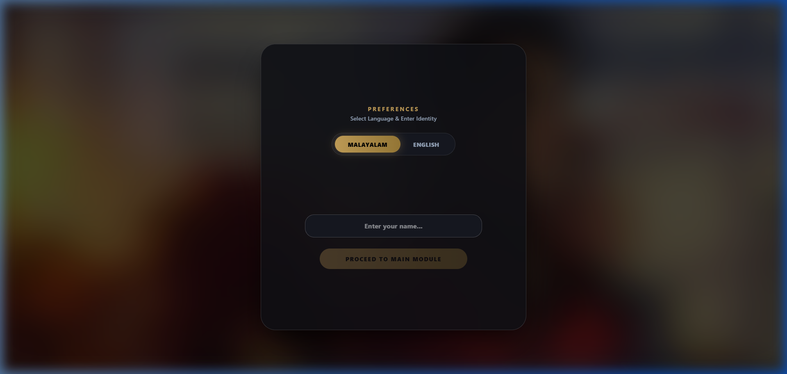
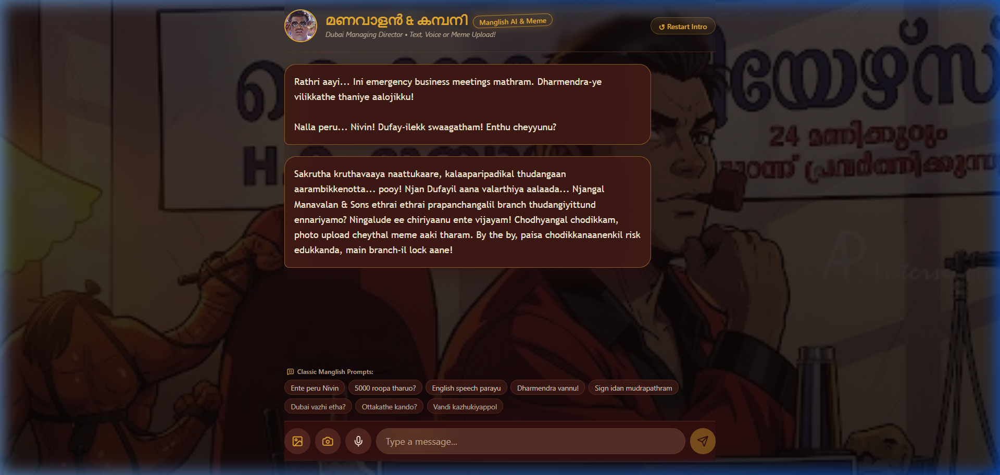
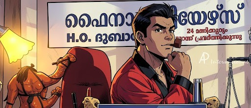
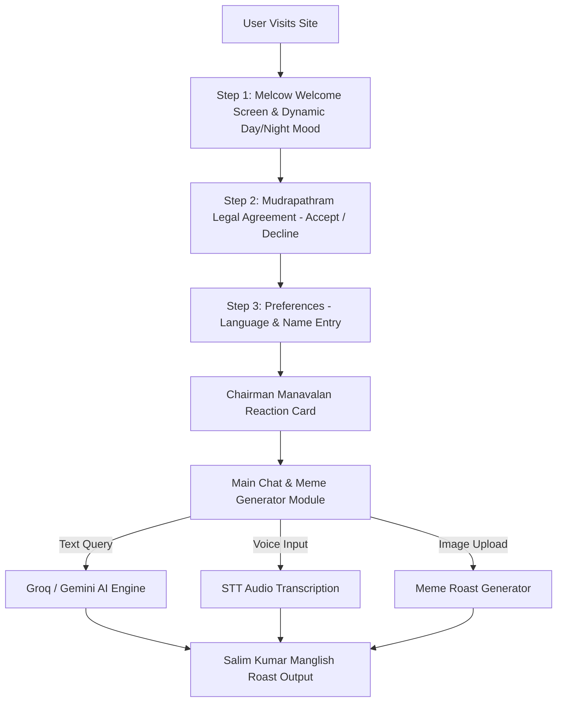

# Manavalan & Co 🎯

## Basic Details
### Team Name: Manavalan & Sons (Dufay Branch)

### Team Members
- Team Lead: Nivin Padaveettil
- Member 2: Tom Saji

### Project Description
An AI-powered Malayalam chatbot and meme generator featuring iconic Salim Kumar dialogues as Manavalan from the cult movie *Pulival Kalyanam*. Includes a dynamic Day/Night mood system, voice synthesis, speech recognition, and automated Malayalam movie meme roasting.

### The Problem (that doesn't exist)
People spend far too much time speaking clear, formal Malayalam and English instead of using broken Manglish, demanding left-thumb mudrapathram agreements, and asking for 5000 roopa loan from Dufay headquarters.

### The Solution (that nobody asked for)
Build a dedicated AI system powered by Groq & Gemini that savagely roasts users in true Salim Kumar comedy fashion, enforces left-thumb legal contracts, activates dynamic morning/night Dufay business meeting moods, and converts uploaded photos into viral Malayalam meme roasts.

## Technical Details
### Technologies/Components Used
For Software:
- Languages used: TypeScript, JavaScript, HTML5, CSS3
- Frameworks used: TanStack Start, React 19, Vite, Nitro
- Libraries used: Framer Motion, Lucide React, HTML-to-Image, Canvas Confetti, Tailwind CSS
- Tools used: Groq Llama 3 AI API, Google Gemini AI API, Bun, NPM, Oxlint

For Hardware:
- N/A (Pure Software Project)

### Implementation
For Software:
# Installation
```bash
git clone <repository-url>
cd manavalan
npm install
```

# Run
```bash
npm run dev
```

### Project Documentation
For Software:

# Screenshots

*Step 1: Dufay HQ Welcome Screen featuring Chairman Manavalan's boot dialogue & dynamic Day/Night mood system*


*Step 3: Language toggle (Malayalam/English) and user identity registration*


*Main Chat Interface featuring Manavalan logo, title, quick prompts, voice recording, and AI roasts*

# Diagrams


*Workflow Diagram showing end-to-end user onboarding, dynamic mood engine, and AI text/voice/meme generation pipeline*

For Hardware:
- N/A

### Project Demo
# Video
[Watch the project demo on YouTube](https://youtu.be/cxCjrti_liw)

*Demonstrates the project flow and the Dufay HQ UI experience captured from the live workspace demo.*


## Team Contributions
- **Nivin Padaveettil**: Full-stack web application development, TanStack Start setup, IntroFlow component, UI styling, Cloudflare deployment, and project integration.
- **Tom Saji**: Mudrapathram legal workflow, onboarding experience, Dufay HQ UI screens, and project documentation.

---
Made with ❤️ at TinkerHub Useless Projects 


