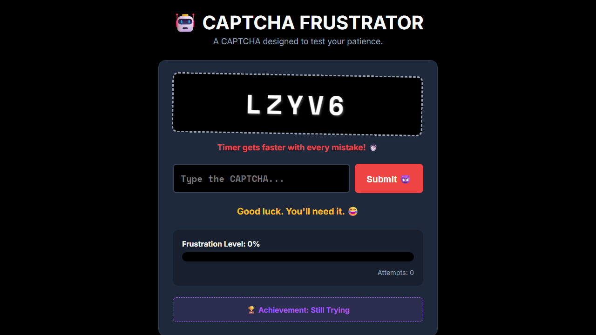
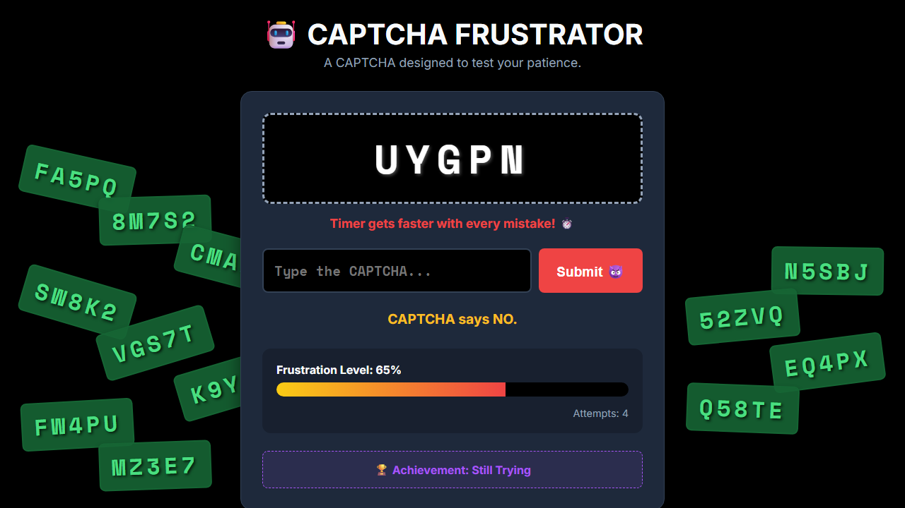
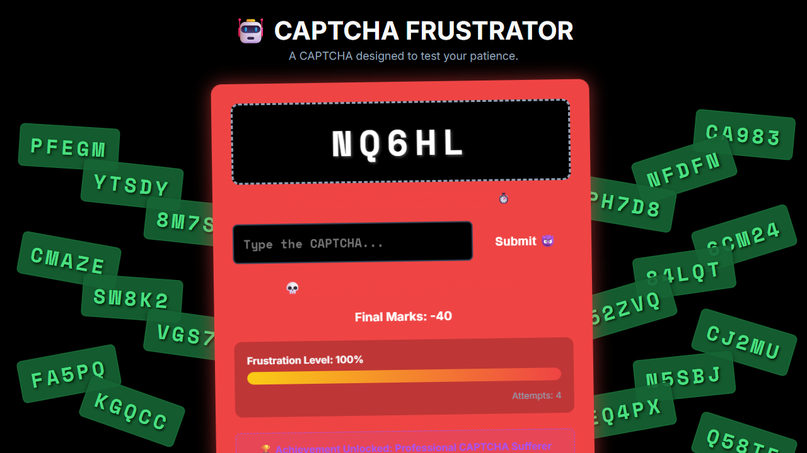

# CAPTCHA Frustrator 🎯


## Basic Details
### Team Name: Arya-techtonic


### Team Members
- Team Lead: Arya Nanda P.
- Member 2: Apoorva S. Saji
- Member 3: [Name] - [College]

### Project Description
CAPTCHA Frustrator is a fake CAPTCHA simulator built purely to drive you insane. It shows you a random CAPTCHA, and just as your fingers find the right keys, it changes — every single second. No security. No purpose. Just pure, distilled frustration delivered straight to your browser.

### The Problem (that doesn't exist)
Have you noticed that CAPTCHAs are getting *too easy*? People are breezing through them without suffering nearly enough. The average human completes a CAPTCHA in under 10 seconds, and that is a *crisis*. Nobody is frustrated enough. Nobody is questioning their humanity enough. We are living in dangerously comfortable times, and something must be done.

### The Solution (that nobody asked for)
CAPTCHA Frustrator fixes this completely imaginary problem by ensuring you *never* successfully complete a CAPTCHA again. The secret? The CAPTCHA changes every second. Just when you think you've nailed it — you haven't. The CAPTCHA has already moved on. It doesn't care about you. Your frustration meter climbs, the timer speeds up with every mistake, and the app cheerfully mocks you the entire time. This is the future of anti-human security.


## Technical Details
### Technologies/Components Used

**For Software:**
- **Languages:** HTML, CSS, JavaScript
- **Frameworks:** None
- **Libraries:** Matter.js (for Jenga-style physics stacking of expired CAPTCHAs)
- **Tools:** Visual Studio Code, Git, GitHub, Web Browser

**For Hardware:**
- No hardware required — this is a software-only project.

### Implementation

**For Software:**

#### Installation
No installation needed. Just clone the repository and open the file in your browser.

```bash
git clone https://github.com/Arya-techtonic/captchafrustrator.git
cd captchafrustrator
```

#### Run
```bash
# Simply open index.html in any modern web browser
start index.html
```
Or just double-click `index.html`. That's it.

### Project Documentation

**For Software:**

#### Screenshots


*The main CAPTCHA interface — looks friendly, is absolutely not. Expired CAPTCHAs pile up like Jenga blocks on the sides.*


*Mid-game chaos: Frustration Level at 65%, blocks stacking up, CAPTCHA says NO.*


*MAXIMUM FRUSTRATION ACHIEVED — 100% frustration, Final Marks: -40, and the card turns red in shame.*


#### Diagrams

*User attempts CAPTCHA → CAPTCHA changes → Frustration increases → Repeat forever.*

**For Hardware:**

*(Not applicable — no hardware components used.)*

### Project Demo

#### Video
[Add your demo video link here]
*A walkthrough of the CAPTCHA Frustrator in action — watch someone slowly lose their mind.*

#### Additional Demos
[Add any extra demo materials/links]


## Team Contributions
- **Arya Nanda P.:** Core game logic, CAPTCHA generation, timer & frustration system, UI design
- **Apoorva S. Saji:** Physics-based Jenga stacking of expired CAPTCHAs, styling, animations
- [Name]: [Specific contributions]

---
Made with ❤️ at TinkerHub Useless Projects 


