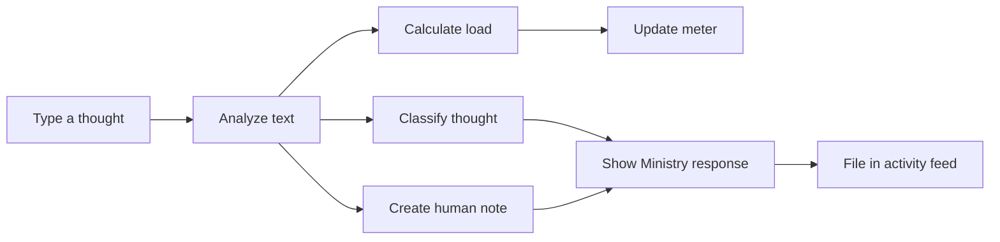

# Ministry of Persistence

### Memory Leak Preserving Technology

The Ministry of Persistence is a playful browser experience for capturing the thoughts that refuse to leave. Type a thought, submit it to the Ministry, and the page will classify it, estimate its cognitive load, offer a human-style response, and file it in the activity feed.

> Forgetting is a feature. We declined.

## Project Details

### Team

- Team name: `[AK47]`
- Team lead: `[N YEDU NANDH]` - `[TKM COLLEGE OF ENGINEERING]`
- Members: `[N YEDU NANDH AND REHANDEEP RD]`

### The Problem That Does Not Exist

People occasionally remember unnecessary things: a forgotten password, an unfinished idea, a person's name from years ago, or the exact reason they opened a browser tab. This project solves the completely fictional problem of thoughts escaping without paperwork.

### The Solution Nobody Asked For

The Ministry of Persistence gives every thought an official case file. It uses a deliberately silly government-office interface to make overthinking feel visible, measurable, and slightly more manageable.

## Features

- Thought input with a 140-character limit
- Live cognitive-load meter while typing
- Thought classification for worry, work, emotion, food, and miscellaneous thoughts
- Human-style response based on the submitted thought
- Activity feed for preserved thoughts
- Emergency thought filing button
- Toggleable Ministry settings
- Responsive layout for desktop and mobile screens

## How It Works

### 1. Enter a thought

The user types a thought into the input box. The load meter updates immediately without requiring submission.

### 2. Estimate cognitive load

The meter calculates a score from 0 to 100 using four signals:

| Signal | Maximum | What it measures |
| --- | ---: | --- |
| Length | 30 | Number of words in the thought |
| Emotion | 30 | Mild and intense emotional words |
| Urgency | 20 | Deadlines, time pressure, and exclamation marks |
| Uncertainty | 20 | Questions, doubt, and uncertainty words |

The score is an illustrative estimate, not a medical or psychological measurement.

### 3. File the thought

When submitted, the application:

1. Classifies the thought.
2. Updates the Ministry response.
3. Displays a human-style note.
4. Increases the preserved-thought counter.
5. Adds the thought to the filing-cabinet activity feed.

## Technical Details

### Technologies Used

- HTML5
- CSS3
- Vanilla JavaScript
- CSS Grid and Flexbox
- Google Fonts: Space Grotesk and DM Mono

### Project Structure

```text
.
├── index.html   # Complete application, styles, and interaction logic
└── README.md    # Project documentation
```

The project intentionally has no build step, framework, backend, database, or external JavaScript dependency.

## Installation and Run

No installation is required.

### Option 1: Open directly

Open `index.html` in a modern browser.

### Option 2: Use a local server

From the project directory, run:

```bash
python3 -m http.server 8000
```

Then open [http://localhost:8000](http://localhost:8000).

## Interaction Guide

1. Type a thought into **Put the thought in the box**.
2. Watch the load meter and its four-part breakdown update while typing.
3. Select **Submit to the ministry**.
4. Read the official classification and human note.
5. Review the preserved thought in the filing cabinet.
6. Use **File emergency thought** for an especially urgent piece of nonsense.

## Design Direction

The interface is styled as a fake public-service office:

- Acid yellow, coral, mint, and paper tones create a playful official-document feel.
- Thick borders and offset shadows make panels feel like stamped forms.
- Monospace labels suggest administrative records.
- The writing combines bureaucratic language with human warmth.

## Project Documentation

### Screenshots

Add screenshots after capturing the application in a browser:


*The Ministry dashboard with the thought-load meter and filing controls.*


*A submitted thought with its load breakdown, classification, and human note.*


*The filing cabinet showing preserved thoughts.*

### Workflow



## Demo

- Live demo: `[Add link if hosted]`
- Demo video: `[https://drive.google.com/file/d/1Whri6NqFQ6Mu12Phld38myGuJPK3pqsM/view?usp=sharing]`

## Team Contributions

- `[N YEDU NANDH]`: Interface design and responsive layout
- `[REHANDEEP RD]`: Thought analysis and interaction logic
- `[N YEDU NANDH AND REHANDEEP RD]`: Documentation, testing, and demo preparation

## Limitations

- Thoughts are processed locally in the browser.
- No thoughts are saved after the page is refreshed.
- The cognitive-load score is for entertainment and demonstration only.
- The human note is rule-based and is not a substitute for professional support.

---

Made with questionable intent at TinkerHub Useless Projects.


